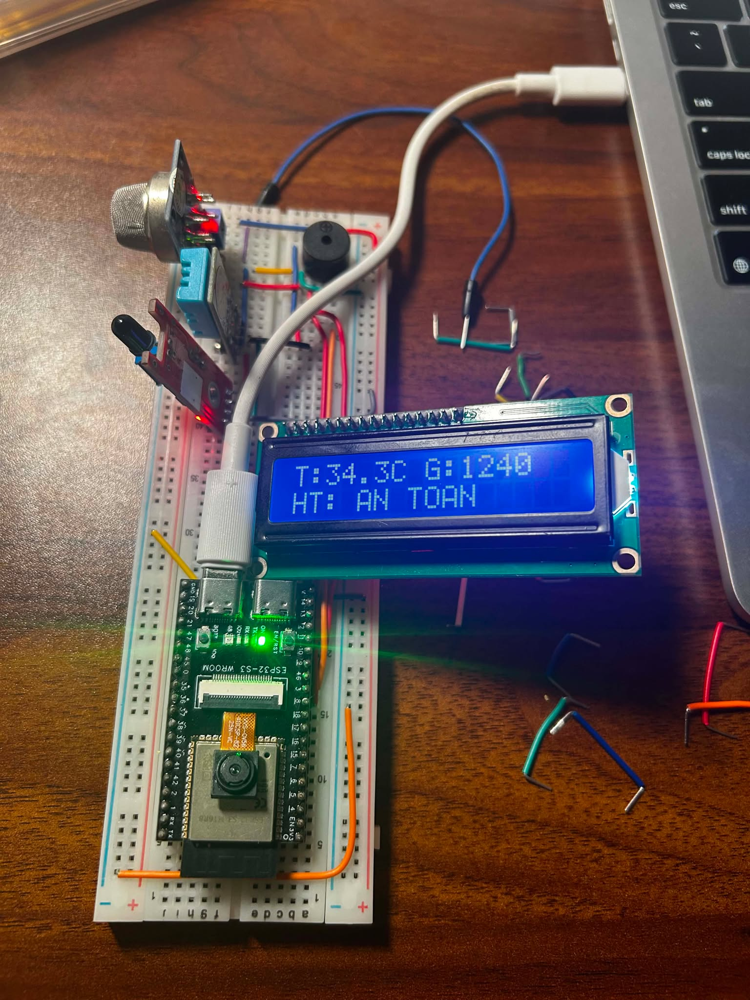
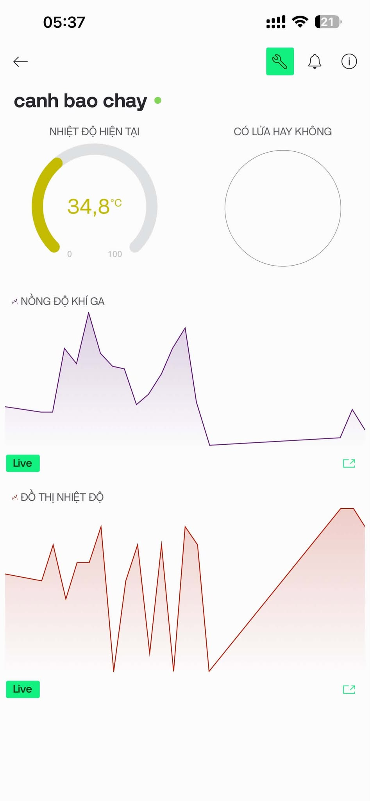

# ESP32 IoT Smart Fire Alarm System

An ESP32-based smart fire alarm and smoke detection system with real-time alerts and IoT cloud monitoring.

---

## 🌟 Key Features

* **Real-time Fire & Smoke Detection:** Continuously monitors ambient temperature and gas/smoke concentration.
* **Instant Alerts:** Sends instant notifications via [Telegram Bot / Blynk / Email / SMS] when thresholds are exceeded.
* **Local Alarms:** Triggers an on-site buzzer and warning LED for immediate evacuation.
* **IoT Dashboard:** Live monitoring of sensor data via [Blynk / Adafruit IO / ThingsBoard / MQTT].
* **Fail-safe Operation:** Works offline for local alarm even if Wi-Fi connection is lost.

---
## 📸 Demo & System Preview

<p align="center">
  
  
</p>

* **Hardware in Action:** Real-time sensor readout displayed on the 16x2 I2C LCD (`Temperature`, `Gas PPM`, and status `AN TOAN`).
* **Mobile Monitoring:** Live telemetry charts and alert indicators synchronized on the mobile dashboard.

---

## 🛠️ Hardware Requirements

* **Microcontroller:** ESP32-S3 DevKit (WROOM / Camera-enabled version)
* **Sensors:**
  * Flame Sensor (Infrared detection)
  * MQ-2 Gas / Smoke Sensor
  * DHT11 Temperature & Humidity Sensor
* **Outputs & Indicators:**
  * Active Buzzer
  * 1602 LCD with PCF8574 I2C Adapter
* **Accessories:** Breadboard, Jumper wires, USB-C Data Cable.

---

## 📱 IoT Cloud Dashboard (Blynk)

The system syncs telemetry data continuously to the mobile app:

* **Current Temperature Gauge:** Displays real-time temperature (°C).
* **Flame Status Indicator:** Real-time visual indicator for fire presence (`Có lửa / Không`).
* **Historical Data Streams:**
  * **Gas Concentration Chart (`NỒNG ĐỘ KHÍ GA`):** Live plot tracking flammable gas & smoke spikes.
  * **Temperature Chart (`ĐỒ THỊ NHIỆT ĐỘ`):** Continuous graph logging temperature fluctuations.
* **On-device LCD Feed:** Displays compact metrics (`T: [Temp]C G: [Gas]` and system safety status).
---

## 🚀 Getting Started

### 1. Prerequisites
* [Arduino IDE](https://www.arduino.cc/en/software) (or VS Code + PlatformIO)
* ESP32 Board Package installed on Arduino IDE
* Required Libraries:
  * `WiFi.h`
  * `DHT sensor library`
  * `Blynk` / `PubSubClient` (for MQTT)
  * `Adafruit_SSD1306` (if using OLED)

### 2. Configuration
Clone the repository and open the sketch:
```bash
git clone [https://github.com/workingdattran/esp32-iot-smart-fire-alarm.git](https://github.com/workingdattran/esp32-iot-smart-fire-alarm.git)
